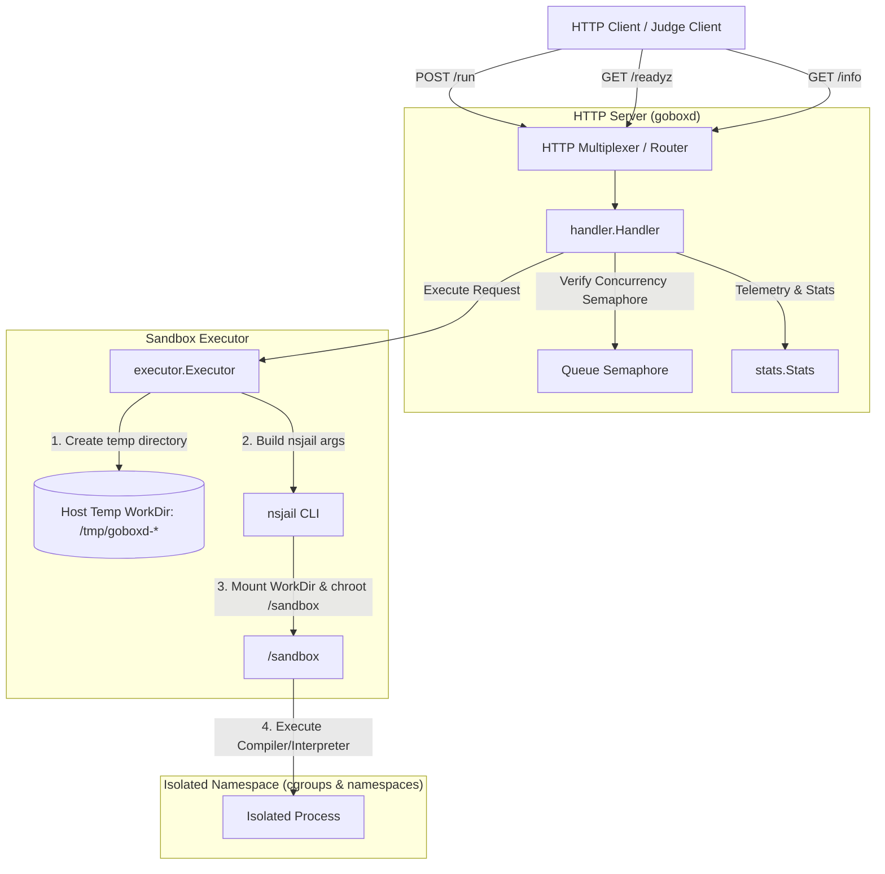
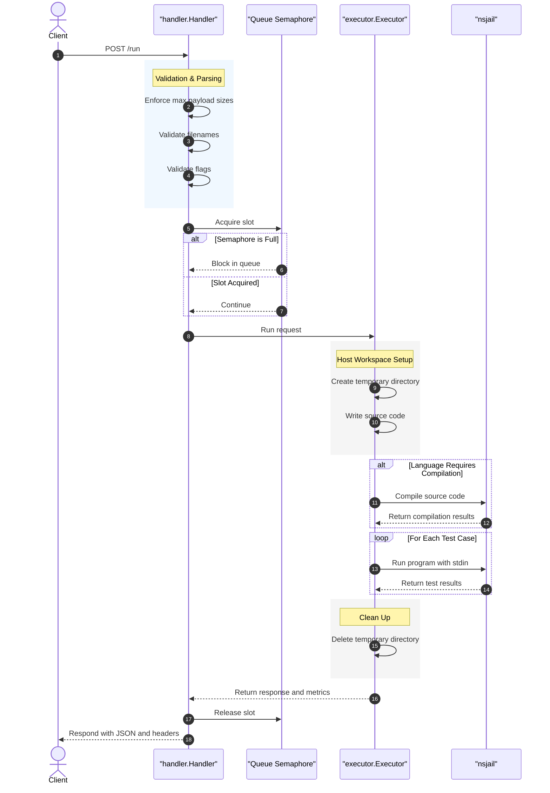

# goboxd Architecture Document

Welcome to **goboxd**! This document provides a comprehensive overview of the `goboxd` system architecture, security model, and execution lifecycle.

---

## 1. System Overview

`goboxd` is a secure, high-performance sandboxed code execution service written in Go. It accepts source code, input test cases, and compiler/execution arguments via HTTP, runs the code in an isolated Linux sandbox using **nsjail**, asserts correctness against expected outputs, and returns metrics along with stdout/stderr.

### Core Architecture Components



---

## 2. Component Breakdown

The codebase is structured under the `server/` directory:

| Component | Directory / File | Description |
| :--- | :--- | :--- |
| **Entry Point** | [`server/main.go`](file:///goboxd/server/main.go) | Configures and starts the HTTP server, loading execution limits and registering routes. |
| **Config Loader** | [`server/config/config.go`](file:///goboxd/server/config/config.go) | Parses YAML configurations, tracks CPU concurrency limits, and replaces template variables (e.g., `{{ FILENAME }}`, `{{ EXTRA_ARGS }}`). |
| **HTTP Handler** | [`server/handler/`](file:///goboxd/server/handler/) | Implements the routing, request size gating, input validation (shell safety, flag allowlists), concurrency queuing, and telemetric responses. |
| **Executor** | [`server/executor/executor.go`](file:///goboxd/server/executor/executor.go) | Prepares isolated workspaces, invokes `nsjail` commands, streams capped stdout/stderr, and parses resource usage. |
| **Data Contracts** | [`server/proto/judge.proto`](file:///goboxd/server/proto/judge.proto) | Defines the Protocol Buffer message structures for execution payloads and results. |
| **Stats Tracker** | [`server/stats/stats.go`](file:///goboxd/server/stats/stats.go) | Captures thread-safe counts of total, failed, and in-flight execution runs. |

---

## 3. The Security & Sandboxing Model

Executing arbitrary untrusted code poses massive security risks. `goboxd` mitigates these risks using a multi-layered security strategy:

### A. Linux Namespaces & Process Isolation
We invoke **nsjail**, which leverages the Linux kernel's namespaces to build a secure jail:
- **Mount Namespace**: The running process sees a localized directory tree.
- **UTS Namespace**: Isolates hostnames and domain names.
- **IPC Namespace**: Isolates System V IPC and POSIX message queues.
- **PID Namespace**: The sandboxed program is assigned `PID 1` inside its namespace, preventing it from seeing or terminating host processes.
- **Network Namespace**: By default, `goboxd` runs `nsjail` with network isolation (`CLONE_NEWNET`). This disables all outbound socket connections, preventing malicious scripts from downloading exploits or initiating DDoS attacks.

### B. Directory Isolation & Chroot
- During the Docker build step, a chroot sandbox environment is built under `/sandbox`. Only runtime executables (like `/usr/bin/gcc`, `/usr/bin/python3`, `/usr/bin/node`) and necessary shared libraries are copied to it.
- **Temporary Workspaces**: For each compilation or run step, `goboxd` creates a dynamic host directory `os.MkdirTemp("", "goboxd-*")`. `nsjail` bind-mounts this host directory directly into `/work` inside the jail, serving as the workspace. The host directory is strictly destroyed when the request completes.

### C. Resource Limits & Cgroups
To prevent Denial of Service (DoS) attacks and resource starvation (e.g., fork bombs, memory leaks):
- **Time Limits**: Configured globally in `languages.yaml` (and overridable via request limits), enforced by `nsjail`'s `--time_limit`.
- **Memory Limits**: Memory usage is capped at the process-level using `--rlimit_as` (Address Space limit in MB) and cgroups memory limits.
- **Process Limits**: Capped using `--rlimit_nproc` to prevent standard fork-bomb attacks.
- **CPU Pinning**: Execution is capped to a single CPU core per job via `--max_cpus 1` to prevent CPU resource monopolization.

### D. Dynamic UID/GID Isolation
If multiple requests are executed concurrently under the same Linux user ID, they might kill each other's processes or write/read each other's files. 
- `goboxd` utilizes a pool of **100,000 UIDs/GIDs** starting from `100000`.
- Each concurrent job is assigned a unique UID/GID modulo the pool size. This prevents file access leaks and process manipulation between concurrent jobs.

### E. Input Validation & Shell Safety
- **Filename Validation**: User-provided filenames are regex-validated (`^[A-Za-z0-9._-]+$`). Path traversal characters (`/`, `\`), null bytes (`\x00`), and dot segments (`.`, `..`) are rejected to prevent file system breakouts.
- **Build/Run Flags Allowlist**: Users can pass custom flags (like `-O3` or `-std=c++17`). These flags are checked against an allowlist specified for each language in `languages.yaml`. Any flag not allowlisted is rejected at the HTTP handler level.

---

## 4. Execution Flow & Lifecycle

The sequence of events for a `/run` request:



---

## 5. Operations & Observability

`goboxd` is designed to be highly visible and self-healing in production.

### Telemetry Headers
Every response from `/run` returns the following performance metrics in headers:
- `X-Queue-Time-Ms`: Duration the request spent waiting in the semaphore queue.
- `X-Wall-Time-Ms`: Actual execution duration on the server (host perspective).
- `X-CPU-Time-Ms`: Total CPU time (User + System time) consumed by the compiler + sandboxed executions.

### Health and Telemetry Endpoints
- **`GET /readyz`**: Readiness check used by orchestrators (Kubernetes/Compose). It performs a live probe of the `nsjail` executable and executes version flags for all configured languages in `languages.yaml`. If any runtime is missing or misconfigured, it returns `503 Service Unavailable` with detailed component errors.
- **`GET /info`**: Returns diagnostic metadata about the build version, Git commit, `nsjail` path/version, default run limits per language, global constraints, and current live stats (active in-flight jobs, total jobs run, and free disk space in the jail directory).

---

## 6. Build & Test

Here is how to get the project running locally.

### Prerequisites
Make sure you have **Docker** and **Docker Compose (v2)** installed. No local Go toolchain is needed.

### Commands
All operations are wrapped in the root [`Makefile`](file:///goboxd/Makefile):

```sh
# 1. Build the Docker container (which builds nsjail & compiles the Go server)
make build

# 2. Spin up the container on port 8000
make up

# 3. Run the API integration test suite
make test

# 4. Run the load test tool (sends 50k requests using 2000 concurrency)
make load

# 5. Shut down the server container
make down
```

### Adding a New Language
To support a new language:
1. Create a setup script under `scripts/lang_install/` (e.g. `golang.sh`) to download compilers/interpreters to the container.
2. Edit [`server/config/languages.yaml`](file:///goboxd/server/config/languages.yaml) and add a configuration entry specifying:
   - `language` identifier.
   - `filename` template naming.
   - `compilation_options` (if compiled) and `runtime_options`.
   - Resource limits (memory, time, processes).
   - An allowlist of build and run flags.
3. Write an integration test payload in the `tests/` directory and add it to `tests/run_integration_tests.sh`.
